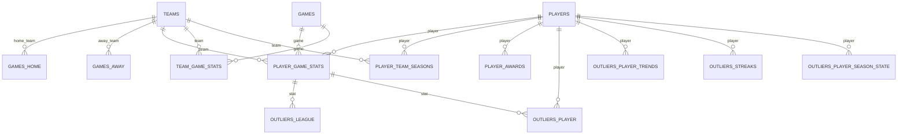

# SCHEMA.md - Arquitectura de Base de Datos

Documentación detallada de las **15 tablas** del sistema Dateados, organizadas en **3 capas lógicas**.

---

## 📊 Resumen

| Capa | Tablas | Propósito |
|------|--------|-----------|
| **Core** | 7 | Datos principales de NBA (equipos, jugadores, partidos, estadísticas) |
| **Outliers** | 5 | Sistema de detección de anomalías y rachas |
| **Sistema** | 3 | Checkpoints, estado de tareas y logging |

**Total:** 15 tablas, 25+ índices, 20+ constraints

---

## 🔗 Diagrama de Relaciones



---

## 📋 Capa 1: Datos Core (7 tablas)

### `teams`

**Descripción:** Equipos de la NBA con información organizativa y geográfica.

**Campos:**

| Campo | Tipo | Constraints | Descripción |
|-------|------|-------------|-------------|
| `id` | Integer | PRIMARY KEY | ID único del equipo (de nba_api) |
| `full_name` | String(100) | NOT NULL | Nombre completo (ej: "Los Angeles Lakers") |
| `abbreviation` | String(25) | UNIQUE, NOT NULL | Abreviatura (ej: "LAL") |
| `city` | String(50) | - | Ciudad (ej: "Los Angeles") |
| `state` | String(50) | - | Estado (ej: "California") |
| `nickname` | String(50) | - | Apodo (ej: "Lakers") |
| `year_founded` | Integer | - | Año de fundación |
| `conference` | String(10) | - | Conferencia: "East" o "West" |
| `division` | String(20) | - | División: Atlantic, Central, Southeast, Northwest, Pacific, Southwest |
| `created_at` | DateTime | NOT NULL | Fecha de creación del registro |
| `updated_at` | DateTime | NOT NULL | Fecha de última actualización |

**Índices:**
- `idx_teams_conference_division` en (`conference`, `division`)

**Relaciones:**
- `home_games`: Partidos como local (→ `games.home_team_id`)
- `away_games`: Partidos como visitante (→ `games.away_team_id`)
- `player_stats`: Estadísticas de jugadores (→ `player_game_stats.team_id`)
- `team_game_stats`: Estadísticas agregadas (→ `team_game_stats.team_id`)
- `player_team_seasons`: Temporadas de jugadores (→ `player_team_seasons.team_id`)

---

### `players`

**Descripción:** Jugadores de la NBA con biografía completa y control de sincronización.

**Campos:**

| Campo | Tipo | Constraints | Descripción |
|-------|------|-------------|-------------|
| `id` | Integer | PRIMARY KEY | ID único del jugador (de nba_api) |
| `full_name` | String(100) | NOT NULL | Nombre completo |
| `birthdate` | Date | - | Fecha de nacimiento |
| `height` | String(10) | - | Altura en formato pies-pulgadas (ej: "6-9") |
| `weight` | Integer | CHECK > 0 | Peso en libras |
| `position` | String(20) | - | Posición: Forward, Guard, Center, etc. |
| `country` | String(50) | - | País de origen |
| `jersey` | String(10) | - | Dorsal actual o último conocido |
| `is_active` | Boolean | NOT NULL, DEFAULT False | True si está activo en la NBA |
| `season_exp` | Integer | CHECK >= 0 | Años de experiencia en la NBA |
| `from_year` | Integer | - | Año de inicio en la NBA |
| `to_year` | Integer | - | Último año activo |
| `draft_year` | Integer | - | Año del draft |
| `draft_round` | Integer | - | Ronda del draft |
| `draft_number` | Integer | - | Número de selección |
| `school` | String(100) | - | Universidad/colegio |
| `awards_synced` | Boolean | NOT NULL, DEFAULT False | True si se sincronizó el palmarés |
| `bio_synced` | Boolean | NOT NULL, DEFAULT False | True si se intentó sincronizar biografía |
| `created_at` | DateTime | NOT NULL | Fecha de creación del registro |
| `updated_at` | DateTime | NOT NULL | Fecha de última actualización |

**Índices:**
- `idx_players_full_name` en `full_name`
- `idx_players_position` en `position`

**Relaciones:**
- `game_stats`: Estadísticas por partido (→ `player_game_stats.player_id`)
- `team_seasons`: Temporadas con equipos (→ `player_team_seasons.player_id`)
- `awards`: Premios y reconocimientos (→ `player_awards.player_id`)
- `outliers_player`: Outliers individuales (→ `outliers_player.player_id`)
- `outliers_trends`: Tendencias de rendimiento (→ `outliers_player_trends.player_id`)
- `streaks`: Rachas de rendimiento (→ `outliers_streaks.player_id`)

---

### `games`

**Descripción:** Partidos con resultados, marcadores por cuarto y tipo de competición.

**Campos:**

| Campo | Tipo | Constraints | Descripción |
|-------|------|-------------|-------------|
| `id` | String(20) | PRIMARY KEY | ID del partido (formato NBA: 00XYZABCDE) |
| `date` | Date | NOT NULL | Fecha del partido |
| `season` | String(10) | NOT NULL | Temporada (ej: "2023-24") |
| `status` | Integer | - | Estado: 1=pendiente, 2=en curso, 3=finalizado |
| `home_team_id` | Integer | FK → teams.id | Equipo local |
| `away_team_id` | Integer | FK → teams.id | Equipo visitante |
| `home_score` | Integer | CHECK >= 0 | Puntos del equipo local |
| `away_score` | Integer | CHECK >= 0 | Puntos del equipo visitante |
| `winner_team_id` | Integer | FK → teams.id | Equipo ganador |
| `quarter_scores` | JSON | - | Marcadores por cuarto (ver estructura abajo) |
| `rs` | Boolean | DEFAULT False | True si es Regular Season |
| `po` | Boolean | DEFAULT False | True si es Playoffs |
| `pi` | Boolean | DEFAULT False | True si es Play-In |
| `ist` | Boolean | DEFAULT False | True si es NBA Cup (In-Season Tournament) |
| `created_at` | DateTime | NOT NULL | Fecha de creación del registro |
| `updated_at` | DateTime | NOT NULL | Fecha de última actualización |

**Índices:**
- `idx_games_date` en `date`
- `idx_games_season` en `season`
- `idx_games_season_date` en (`season`, `date`)
- `idx_games_home_away` en (`home_team_id`, `away_team_id`)

**Estructura JSON de `quarter_scores`:**
```json
{
  "home": [30, 28, 32, 30],
  "away": [28, 30, 27, 30]
}
```

Con overtimes:
```json
{
  "home": [30, 28, 32, 30, 10, 5],
  "away": [28, 30, 27, 30, 10, 8]
}
```

**Propiedades calculadas:**
- `is_finished`: True si `status == 3`

**Relaciones:**
- `home_team`: Equipo local (→ `teams.id`)
- `away_team`: Equipo visitante (→ `teams.id`)
- `winner_team`: Equipo ganador (→ `teams.id`)
- `player_stats`: Estadísticas individuales (→ `player_game_stats.game_id`)
- `team_stats`: Estadísticas agregadas (→ `team_game_stats.game_id`)

---

### `player_game_stats`

**Descripción:** Estadísticas individuales de cada jugador por partido. **Tabla principal de análisis**.

**Campos:**

| Campo | Tipo | Constraints | Descripción |
|-------|------|-------------|-------------|
| `id` | Integer | PRIMARY KEY | ID único autoincrementado |
| `game_id` | String(20) | FK → games.id, NOT NULL | ID del partido |
| `player_id` | Integer | FK → players.id, NOT NULL | ID del jugador |
| `team_id` | Integer | FK → teams.id, NOT NULL | ID del equipo |
| `min` | Interval | - | Minutos jugados (formato: MM:SS) |
| `pts` | Integer | CHECK >= 0 | Puntos |
| `reb` | Integer | CHECK >= 0 | Rebotes totales |
| `ast` | Integer | CHECK >= 0 | Asistencias |
| `stl` | Integer | CHECK >= 0 | Robos |
| `blk` | Integer | CHECK >= 0 | Tapones |
| `tov` | Integer | CHECK >= 0 | Pérdidas |
| `pf` | Integer | CHECK >= 0 | Faltas personales |
| `plus_minus` | Integer | - | +/- del jugador |
| `fgm` | Integer | CHECK >= 0 | Tiros de campo anotados |
| `fga` | Integer | CHECK >= 0 | Tiros de campo intentados |
| `fg_pct` | Float | CHECK 0-1 | Porcentaje de tiros de campo |
| `fg3m` | Integer | CHECK >= 0 | Triples anotados |
| `fg3a` | Integer | CHECK >= 0 | Triples intentados |
| `fg3_pct` | Float | CHECK 0-1 | Porcentaje de triples |
| `ftm` | Integer | CHECK >= 0 | Tiros libres anotados |
| `fta` | Integer | CHECK >= 0 | Tiros libres intentados |
| `ft_pct` | Float | CHECK 0-1 | Porcentaje de tiros libres |
| `created_at` | DateTime | NOT NULL | Fecha de creación |
| `updated_at` | DateTime | NOT NULL | Fecha de actualización |

**Constraints adicionales:**
- `UNIQUE(game_id, player_id)`: Un jugador solo puede tener una línea por partido
- `CHECK(fgm <= fga)`: Anotados ≤ intentados
- `CHECK(fg3m <= fgm)`: Triples ≤ tiros de campo totales
- `CHECK(ftm <= fta)`: Tiros libres anotados ≤ intentados

**Índices:**
- `idx_player_game_stats_game` en `game_id`
- `idx_player_game_stats_player` en `player_id`
- `idx_player_game_stats_team` en `team_id`
- `idx_player_game_stats_player_game` en (`player_id`, `game_id`)
- `idx_player_game_stats_team_game` en (`team_id`, `game_id`)

**Propiedades calculadas:**
- `is_triple_double`: True si 10+ en 3 categorías (pts, reb, ast, stl, blk)
- `is_double_double`: True si 10+ en 2 categorías
- `minutes_formatted`: Convierte Interval a string "MM:SS"

**Relaciones:**
- `game`: Partido asociado (→ `games.id`)
- `player`: Jugador asociado (→ `players.id`)
- `team`: Equipo asociado (→ `teams.id`)
- `league_outliers`: Anomalías de liga (→ `outliers_league.player_game_stat_id`)
- `player_outliers`: Outliers individuales (→ `outliers_player.player_game_stat_id`)

---

### `player_team_seasons`

**Descripción:** Estadísticas agregadas por jugador, equipo, temporada y tipo de competición.

**Campos:**

| Campo | Tipo | Constraints | Descripción |
|-------|------|-------------|-------------|
| `id` | Integer | PRIMARY KEY | ID único |
| `player_id` | Integer | FK → players.id, NOT NULL | ID del jugador |
| `team_id` | Integer | FK → teams.id, NOT NULL | ID del equipo |
| `season` | String(10) | NOT NULL | Temporada (ej: "2023-24") |
| `type` | String(20) | NOT NULL | Tipo: "Regular Season", "Playoffs", "NBA Cup", "Play-In" |
| `games_played` | Integer | CHECK >= 0 | Partidos jugados |
| `minutes` | Integer | CHECK >= 0 | Minutos totales |
| `pts` | Integer | CHECK >= 0 | Puntos totales |
| `reb` | Integer | CHECK >= 0 | Rebotes totales |
| `ast` | Integer | CHECK >= 0 | Asistencias totales |
| `stl` | Integer | CHECK >= 0 | Robos totales |
| `blk` | Integer | CHECK >= 0 | Tapones totales |
| `tov` | Integer | CHECK >= 0 | Pérdidas totales |
| `pf` | Integer | CHECK >= 0 | Faltas totales |
| `fgm` | Integer | CHECK >= 0 | Tiros de campo anotados |
| `fga` | Integer | CHECK >= 0 | Tiros de campo intentados |
| `fg3m` | Integer | CHECK >= 0 | Triples anotados |
| `fg3a` | Integer | CHECK >= 0 | Triples intentados |
| `ftm` | Integer | CHECK >= 0 | Tiros libres anotados |
| `fta` | Integer | CHECK >= 0 | Tiros libres intentados |
| `plus_minus` | Integer | - | +/- total |
| `is_detailed` | Boolean | DEFAULT False | True si se generó desde `player_game_stats` |
| `start_date` | Date | - | Fecha del primer partido |
| `end_date` | Date | - | Fecha del último partido |
| `created_at` | DateTime | NOT NULL | Fecha de creación |
| `updated_at` | DateTime | NOT NULL | Fecha de actualización |

**Constraints:**
- `UNIQUE(player_id, team_id, season, type)`: No duplicados

**Índices:**
- `idx_player_team_seasons_player` en `player_id`
- `idx_player_team_seasons_team` en `team_id`
- `idx_player_team_seasons_season` en `season`
- `idx_player_team_seasons_type` en `type`
- `idx_player_team_seasons_player_season_type` en (`player_id`, `season`, `type`)
- `idx_player_team_seasons_player_team_season` en (`player_id`, `team_id`, `season`)

**Relaciones:**
- `player`: Jugador asociado (→ `players.id`)
- `team`: Equipo asociado (→ `teams.id`)

---

### `team_game_stats`

**Descripción:** Estadísticas agregadas del equipo por partido (suma de estadísticas de jugadores).

**Campos:**

| Campo | Tipo | Constraints | Descripción |
|-------|------|-------------|-------------|
| `id` | Integer | PRIMARY KEY | ID único |
| `game_id` | String(20) | FK → games.id, NOT NULL | ID del partido |
| `team_id` | Integer | FK → teams.id, NOT NULL | ID del equipo |
| `total_pts` | Integer | CHECK >= 0 | Puntos totales del equipo |
| `total_reb` | Integer | CHECK >= 0 | Rebotes totales |
| `total_ast` | Integer | CHECK >= 0 | Asistencias totales |
| `total_stl` | Integer | CHECK >= 0 | Robos totales |
| `total_blk` | Integer | CHECK >= 0 | Tapones totales |
| `total_tov` | Integer | CHECK >= 0 | Pérdidas totales |
| `total_pf` | Integer | CHECK >= 0 | Faltas totales |
| `avg_plus_minus` | Float | - | Promedio de +/- del equipo |
| `total_fgm` | Integer | CHECK >= 0 | Tiros de campo anotados |
| `total_fga` | Integer | CHECK >= 0 | Tiros de campo intentados |
| `fg_pct` | Float | CHECK 0-1 | Porcentaje de tiros de campo |
| `total_fg3m` | Integer | CHECK >= 0 | Triples anotados |
| `total_fg3a` | Integer | CHECK >= 0 | Triples intentados |
| `fg3_pct` | Float | CHECK 0-1 | Porcentaje de triples |
| `total_ftm` | Integer | CHECK >= 0 | Tiros libres anotados |
| `total_fta` | Integer | CHECK >= 0 | Tiros libres intentados |
| `ft_pct` | Float | CHECK 0-1 | Porcentaje de tiros libres |
| `created_at` | DateTime | NOT NULL | Fecha de creación |
| `updated_at` | DateTime | NOT NULL | Fecha de actualización |

**Constraints:**
- `UNIQUE(game_id, team_id)`: Un equipo por partido

**Índices:**
- `idx_team_game_stats_game` en `game_id`
- `idx_team_game_stats_team` en `team_id`
- `idx_team_game_stats_team_game` en (`team_id`, `game_id`)

**Relaciones:**
- `game`: Partido asociado (→ `games.id`)
- `team`: Equipo asociado (→ `teams.id`)

---

### `player_awards`

**Descripción:** Premios y reconocimientos de jugadores.

**Campos:**

| Campo | Tipo | Constraints | Descripción |
|-------|------|-------------|-------------|
| `id` | Integer | PRIMARY KEY | ID único |
| `player_id` | Integer | FK → players.id, NOT NULL | ID del jugador |
| `season` | String(10) | NOT NULL | Temporada (ej: "2023-24") |
| `award_type` | String(50) | NOT NULL | Tipo de premio (ver lista abajo) |
| `award_name` | String(100) | - | Nombre completo del premio |
| `description` | String(200) | - | Descripción adicional |
| `created_at` | DateTime | NOT NULL | Fecha de creación |
| `updated_at` | DateTime | NOT NULL | Fecha de actualización |

**Constraints:**
- `UNIQUE(player_id, season, award_type, award_name, description)`: No duplicados

**Índices:**
- `idx_player_awards_player` en `player_id`
- `idx_player_awards_season` en `season`
- `idx_player_awards_type` en `award_type`

**Tipos de premios (`award_type`):**
- `MVP`: Most Valuable Player
- `Champion`: Campeón NBA
- `Finals MVP`: MVP de las Finales
- `All-Star`: All-Star Game
- `All-NBA`: All-NBA Team (First, Second, Third)
- `All-Defensive`: All-Defensive Team
- `DPOY`: Defensive Player of the Year
- `ROY`: Rookie of the Year
- `6MOY`: Sixth Man of the Year
- `MIP`: Most Improved Player
- `POTW`: Player of the Week
- `POTM`: Player of the Month

**Relaciones:**
- `player`: Jugador asociado (→ `players.id`)

---

## 🔍 Capa 2: Sistema de Outliers (5 tablas)

### `outliers_league`

**Modelo:** `LeagueOutlier`

**Descripción:** Anomalías detectadas por el Autoencoder a nivel de liga.

**Campos:**

| Campo | Tipo | Constraints | Descripción |
|-------|------|-------------|-------------|
| `id` | Integer | PRIMARY KEY | ID único |
| `player_game_stat_id` | Integer | FK → player_game_stats.id, NOT NULL | Estadística asociada |
| `reconstruction_error` | Float | NOT NULL | Error de reconstrucción del autoencoder |
| `percentile` | Float | CHECK 0-100 | Percentil del error (0-100) |
| `feature_contributions` | JSON | - | Contribuciones por feature (ver estructura) |
| `detection_date` | DateTime | NOT NULL | Fecha de detección |
| `time_window` | String(20) | - | Ventana: "last_game", "week", "month", "season" |
| `created_at` | DateTime | NOT NULL | Fecha de creación |

**Índices:**
- `idx_outliers_league_stat` en `player_game_stat_id`
- `idx_outliers_league_percentile` en `percentile` DESC
- `idx_outliers_league_window` en `time_window`
- `idx_outliers_league_detection_date` en `detection_date`

**Estructura JSON de `feature_contributions`:**
```json
{
  "pts": 0.35,
  "ast": 0.22,
  "reb": 0.18,
  "stl": 0.10,
  "blk": 0.08,
  "fg_pct": 0.04,
  "fg3_pct": 0.02,
  "min": 0.01
}
```

**Relaciones:**
- `player_game_stat`: Estadística asociada (→ `player_game_stats.id`)

---

### `outliers_player`

**Modelo:** `PlayerOutlier`

**Descripción:** Explosiones/crisis detectadas por Z-Score comparando contra historial personal.

**Campos:**

| Campo | Tipo | Constraints | Descripción |
|-------|------|-------------|-------------|
| `id` | Integer | PRIMARY KEY | ID único |
| `player_game_stat_id` | Integer | FK → player_game_stats.id, NOT NULL | Estadística asociada |
| `outlier_type` | String(20) | NOT NULL | Tipo: "explosion" o "crisis" |
| `z_scores` | JSON | NOT NULL | Z-scores por feature (ver estructura) |
| `detection_date` | DateTime | NOT NULL | Fecha de detección |
| `time_window` | String(20) | - | Ventana temporal |
| `created_at` | DateTime | NOT NULL | Fecha de creación |

**Índices:**
- `idx_outliers_player_stat` en `player_game_stat_id`
- `idx_outliers_player_type` en `outlier_type`
- `idx_outliers_player_window` en `time_window`

**Estructura JSON de `z_scores`:**
```json
{
  "pts": 3.2,
  "ast": 1.8,
  "reb": 0.5,
  "stl": 2.1,
  "blk": -0.3,
  "tov": -1.2,
  "fga": 2.8,
  "fta": 1.5,
  "fg3a": 2.4,
  "fg_pct": 1.9,
  "fg3_pct": 2.5,
  "ft_pct": 0.2
}
```

**Tipos de outlier:**
- `explosion`: Rendimiento excepcional (Z-score > 2.0 en al menos una feature)
- `crisis`: Rendimiento bajo (Z-score < -2.0 en al menos una feature)

**Relaciones:**
- `player_game_stat`: Estadística asociada (→ `player_game_stats.id`)

---

### `outliers_player_trends`

**Modelo:** `PlayerTrendOutlier`

**Descripción:** Cambios sostenidos de rendimiento en ventanas temporales (7 o 30 días).

**Campos:**

| Campo | Tipo | Constraints | Descripción |
|-------|------|-------------|-------------|
| `id` | Integer | PRIMARY KEY | ID único |
| `player_id` | Integer | FK → players.id, NOT NULL | ID del jugador |
| `season` | String(10) | NOT NULL | Temporada |
| `outlier_type` | String(20) | NOT NULL | Tipo: "improvement" o "decline" |
| `window_days` | Integer | NOT NULL | Ventana: 7 (semana) o 30 (mes) |
| `baseline_avg` | JSON | NOT NULL | Promedios históricos (antes de la ventana) |
| `current_avg` | JSON | NOT NULL | Promedios en la ventana actual |
| `z_scores` | JSON | NOT NULL | Z-scores de la diferencia |
| `detection_date` | DateTime | NOT NULL | Fecha de detección |
| `created_at` | DateTime | NOT NULL | Fecha de creación |

**Índices:**
- `idx_outliers_player_trends_player` en `player_id`
- `idx_outliers_player_trends_season` en `season`
- `idx_outliers_player_trends_window` en `window_days`

**Estructura JSON de `baseline_avg` y `current_avg`:**
```json
{
  "pts": 25.3,
  "reb": 7.2,
  "ast": 6.8,
  "stl": 1.5,
  "blk": 0.8,
  ...
}
```

**Relaciones:**
- `player`: Jugador asociado (→ `players.id`)

---

### `outliers_streaks`

**Modelo:** `StreakRecord`

**Descripción:** Registro de rachas de rendimiento de jugadores.

**Campos:**

| Campo | Tipo | Constraints | Descripción |
|-------|------|-------------|-------------|
| `id` | Integer | PRIMARY KEY | ID único |
| `player_id` | Integer | FK → players.id, NOT NULL | ID del jugador |
| `streak_type` | String(30) | NOT NULL | Tipo de racha (ver lista) |
| `competition_type` | String(20) | NOT NULL | "RS", "PO", "PI", "IST" |
| `current_count` | Integer | CHECK >= 0 | Cuenta actual de la racha |
| `is_active` | Boolean | DEFAULT True | True si la racha sigue activa |
| `start_game_id` | String(20) | FK → games.id | Primer partido de la racha |
| `last_game_id` | String(20) | FK → games.id | Último partido de la racha |
| `broken_game_id` | String(20) | FK → games.id | Partido donde se rompió |
| `start_date` | Date | - | Fecha de inicio |
| `last_date` | Date | - | Fecha del último partido |
| `broken_date` | Date | - | Fecha de ruptura |
| `is_notable` | Boolean | DEFAULT False | True si ≥5% del récord absoluto |
| `is_historical` | Boolean | DEFAULT False | True si ≥70% del récord (badge histórico) |
| `created_at` | DateTime | NOT NULL | Fecha de creación |
| `updated_at` | DateTime | NOT NULL | Fecha de actualización |

**Constraints:**
- `UNIQUE(player_id, streak_type, competition_type, start_game_id)`: No duplicados

**Índices:**
- `idx_outliers_streaks_player` en `player_id`
- `idx_outliers_streaks_type` en `streak_type`
- `idx_outliers_streaks_competition` en `competition_type`
- `idx_outliers_streaks_active` en `is_active`
- `idx_outliers_streaks_notable` en `is_notable`
- `idx_outliers_streaks_historical` en `is_historical`

**Tipos de rachas (`streak_type`):**
- `pts_20`: 20+ puntos
- `pts_30`: 30+ puntos
- `pts_40`: 40+ puntos
- `triple_double`: Triple-dobles
- `reb_10`: 10+ rebotes
- `ast_10`: 10+ asistencias
- `fg_pct_60`: 60%+ tiros de campo (mínimo 5 intentos)
- `fg3_pct_50`: 50%+ triples (mínimo 3 intentos)
- `ft_pct_90`: 90%+ tiros libres (mínimo 3 intentos)

**Tipos de competición:**
- `RS`: Regular Season
- `PO`: Playoffs
- `PI`: Play-In
- `IST`: NBA Cup (In-Season Tournament)

**Estados:**
- `is_active = True`: Racha en curso
- `is_notable = True`: ≥5% del récord absoluto (se muestra en UI)
- `is_historical = True`: ≥70% del récord (badge histórico)

**Relaciones:**
- `player`: Jugador asociado (→ `players.id`)
- `start_game`: Primer partido (→ `games.id`)
- `last_game`: Último partido (→ `games.id`)
- `broken_game`: Partido de ruptura (→ `games.id`)

---

### `outliers_streak_all_time_records`

**Modelo:** `StreakAllTimeRecord`

**Descripción:** Caché de récords absolutos por tipo de racha y competición para comparaciones rápidas.

**Campos:**

| Campo | Tipo | Constraints | Descripción |
|-------|------|-------------|-------------|
| `id` | Integer | PRIMARY KEY | ID único |
| `streak_type` | String(30) | NOT NULL | Tipo de racha |
| `competition_type` | String(20) | NOT NULL | Tipo de competición |
| `record_count` | Integer | NOT NULL | Cuenta del récord absoluto |
| `player_id` | Integer | FK → players.id | Jugador con el récord |
| `start_date` | Date | - | Fecha de inicio del récord |
| `end_date` | Date | - | Fecha de fin del récord |
| `last_updated` | DateTime | NOT NULL | Última actualización del caché |

**Constraints:**
- `UNIQUE(streak_type, competition_type)`: Un récord por tipo/competición

**Propósito:**
- Evitar escanear toda la tabla `outliers_streaks` en cada detección
- Comparación O(1) para determinar notabilidad e historialidad
- Se actualiza automáticamente cuando se rompe un récord

**Relaciones:**
- `player`: Jugador con el récord (→ `players.id`)

---

## ⚙️ Capa 3: Sistema y Auditoría (3 tablas)

### `ingestion_checkpoints`

**Modelo:** `IngestionCheckpoint`

**Descripción:** Checkpoints para ingesta resumible tras interrupciones.

**Campos:**

| Campo | Tipo | Constraints | Descripción |
|-------|------|-------------|-------------|
| `id` | Integer | PRIMARY KEY | ID único |
| `checkpoint_type` | String(30) | NOT NULL | Tipo: "season", "awards", "daily", "boxscore" |
| `checkpoint_key` | String(100) | NOT NULL | Clave única (ej: "season-2023-24") |
| `status` | String(20) | NOT NULL | Estado: "pending", "in_progress", "completed", "failed" |
| `last_game_id` | String(20) | - | Último partido procesado |
| `last_player_id` | Integer | - | Último jugador procesado |
| `games_processed` | Integer | DEFAULT 0 | Partidos procesados |
| `error_count` | Integer | DEFAULT 0 | Errores acumulados |
| `last_error` | String(500) | - | Último mensaje de error |
| `metadata_json` | JSON | - | Metadata adicional (ej: total de partidos) |
| `created_at` | DateTime | NOT NULL | Fecha de creación |
| `updated_at` | DateTime | NOT NULL | Fecha de actualización |

**Constraints:**
- `UNIQUE(checkpoint_type, checkpoint_key)`: Un checkpoint por tipo/clave

**Índices:**
- `idx_ingestion_checkpoints_type_key` en (`checkpoint_type`, `checkpoint_key`)
- `idx_ingestion_checkpoints_status` en `status`

**Tipos de checkpoint:**
- `season`: Ingesta de temporada completa
- `awards`: Sincronización de premios
- `daily`: Ingesta diaria incremental
- `boxscore`: Procesamiento de box scores

**Estados:**
- `pending`: No iniciado
- `in_progress`: En proceso
- `completed`: Finalizado exitosamente
- `failed`: Error crítico

**Estructura JSON de `metadata_json`:**
```json
{
  "total": 820,
  "start_date": "2023-10-24",
  "end_date": "2024-04-14",
  "worker_id": "Worker-2023-24"
}
```

---

### `system_status`

**Modelo:** `SystemStatus`

**Descripción:** Estado de tareas del sistema para monitoreo en tiempo real.

**Campos:**

| Campo | Tipo | Constraints | Descripción |
|-------|------|-------------|-------------|
| `task_name` | String(50) | PRIMARY KEY | Nombre de la tarea (ej: "ingestion", "outlier_detection") |
| `status` | String(20) | NOT NULL | Estado: "idle", "running", "completed", "failed" |
| `progress` | Integer | CHECK 0-100 | Progreso 0-100% |
| `message` | String(200) | - | Mensaje de estado |
| `last_run` | DateTime | - | Última ejecución |
| `updated_at` | DateTime | NOT NULL | Última actualización |

**Estados:**
- `idle`: En reposo, sin actividad
- `running`: En ejecución
- `completed`: Finalizado exitosamente
- `failed`: Error en la ejecución

**Tareas típicas:**
- `ingestion`: Proceso de ingesta principal
- `outlier_detection`: Detección de outliers
- `awards_sync`: Sincronización de premios
- `bio_sync`: Sincronización de biografías

**Uso:**
- Consultado por `/admin/ingest/status` para actualizar UI en tiempo real
- Limpiado automáticamente al iniciar nueva ingesta (si `CLEAR_LOGS_ON_INGESTION_START=true`)

---

### `log_entries`

**Modelo:** `LogEntry`

**Descripción:** Logs persistentes del sistema en base de datos.

**Campos:**

| Campo | Tipo | Constraints | Descripción |
|-------|------|-------------|-------------|
| `id` | Integer | PRIMARY KEY | ID único |
| `timestamp` | DateTime | NOT NULL | Fecha y hora del log (UTC) |
| `level` | String(10) | NOT NULL | Nivel: DEBUG, INFO, WARNING, ERROR, CRITICAL |
| `module` | String(100) | NOT NULL | Módulo que generó el log (ej: "dateados.ingestion") |
| `message` | String(1000) | NOT NULL | Mensaje del log |
| `traceback` | String(5000) | - | Traceback completo en caso de excepción |

**Índices:**
- `idx_log_entries_timestamp` en `timestamp` DESC
- `idx_log_entries_level` en `level`

**Niveles:**
- `DEBUG`: Información detallada para debugging
- `INFO`: Eventos normales del sistema
- `WARNING`: Advertencias que no impiden la ejecución
- `ERROR`: Errores que impiden operación específica
- `CRITICAL`: Errores críticos que pueden detener el sistema

**Uso:**
- Escrito automáticamente por `SQLAlchemyHandler` (ver `db/logging.py`)
- Consultado por `python -m db.utils.view_logs`
- Limpiado con `python -m db.utils.log_cleanup --days N`

---

## 🔧 Índices y Optimizaciones

### Índices Compuestos Clave

**Alta frecuencia de uso:**
1. `idx_games_season_date` en (`season`, `date`): Filtrado por temporada + orden cronológico
2. `idx_player_game_stats_player_game` en (`player_id`, `game_id`): Búsqueda de estadísticas de jugador en partido
3. `idx_player_team_seasons_player_season_type` en (`player_id`, `season`, `type`): Stats agregadas por temporada

**Rendimiento de outliers:**
4. `idx_outliers_league_percentile` en `percentile` DESC: Top outliers ordenados
5. `idx_outliers_streaks_active` en `is_active`: Rachas activas (filtrado común)

### Constraints y Validaciones

**Integridad de shooting stats:**
- `CHECK(fgm <= fga)`: Evita datos inconsistentes de API
- `CHECK(fg3m <= fgm)`: Triples no pueden superar tiros de campo totales
- `CHECK(ftm <= fta)`: Tiros libres anotados ≤ intentados

**Unicidad:**
- `UNIQUE(game_id, player_id)` en `player_game_stats`: Un jugador por partido
- `UNIQUE(player_id, team_id, season, type)` en `player_team_seasons`: No duplicados

**Validación de valores:**
- `CHECK(weight > 0)` en `players`
- `CHECK(season_exp >= 0)` en `players`
- `CHECK(pts >= 0)`, `CHECK(reb >= 0)`, etc. en `player_game_stats`
- `CHECK(fg_pct >= 0 AND fg_pct <= 1)`: Porcentajes entre 0 y 1

---

## 📐 Diagrama ASCII de Relaciones

```
┌──────────────────────────────────────────────────────────────┐
│                        DATOS CORE                            │
├──────────────────────────────────────────────────────────────┤
│                                                              │
│  teams (30+)                                                 │
│    ├──> home_games (games.home_team_id)                     │
│    ├──> away_games (games.away_team_id)                     │
│    ├──> player_stats (player_game_stats.team_id)            │
│    └──> team_stats (team_game_stats.team_id)                │
│                                                              │
│  players (4,500+)                                            │
│    ├──> game_stats (player_game_stats.player_id)            │
│    ├──> team_seasons (player_team_seasons.player_id)        │
│    ├──> awards (player_awards.player_id)                    │
│    └──> [outliers tables...]                                │
│                                                              │
│  games (50,000+)                                             │
│    ├──> player_stats (player_game_stats.game_id)            │
│    └──> team_stats (team_game_stats.game_id)                │
│                                                              │
│  player_game_stats (1.2M+) ◄── TABLA PRINCIPAL              │
│    ├──> outliers_league                                     │
│    └──> outliers_player                                     │
│                                                              │
├──────────────────────────────────────────────────────────────┤
│                    SISTEMA DE OUTLIERS                       │
├──────────────────────────────────────────────────────────────┤
│                                                              │
│  outliers_league (Autoencoder)                               │
│    └──> player_game_stat                                    │
│                                                              │
│  outliers_player (Z-Score)                                   │
│    └──> player_game_stat                                    │
│                                                              │
│  outliers_player_trends (Tendencias)                         │
│    └──> player                                              │
│                                                              │
│  outliers_streaks (Rachas)                                   │
│    ├──> player                                              │
│    └──> games (start, last, broken)                         │
│                                                              │
│  outliers_streak_all_time_records (Caché)                   │
│    └──> player (record holder)                              │
│                                                              │
├──────────────────────────────────────────────────────────────┤
│                   SISTEMA Y AUDITORÍA                        │
├──────────────────────────────────────────────────────────────┤
│                                                              │
│  ingestion_checkpoints (Resumable)                           │
│  system_status (Monitoreo)                                   │
│  log_entries (Logs)                                          │
│                                                              │
└──────────────────────────────────────────────────────────────┘
```

---

*Última actualización: Enero 2025*
